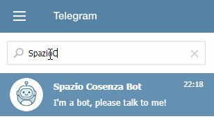
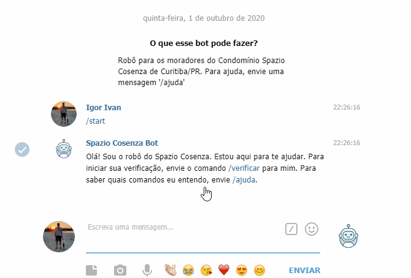

# SpazioCozenzaBot
Bot do Telegram para o condomínio Spazio Cosenza de Curitiba, Brasil.
Este robô tem o intuito de ser uma interface fácil e prática para os moradores interagirem com o 
dia-a-dia do condomínio.

O Bot possui a função de privacidade de grupos ativada, ou seja, se ele for 
adicionado em algum grupo, só lerá as mensagens enviadas diretamente para ele.

***

## Comandos disponíveis
- **/start**: inicia uma conversa com o bot.
- **/verificar**: inicia a verificação do seu usuário como morador.
- **/sair**: caso você não queira mais ser um usuário verificado, esse comando irá apagar seus 
dados armazenados pelo robô.
- **/temagua**: informa se estamos com o abastecimento de água interrompido devido ao racionamento.
- **/ajuda**: exibe uma mensagem para ajudar no uso do bot.

***

## Como encontrar o bot:
No aplicativo do Telegram, procure por SpazioCosenzaBot na busca de contatos. Se o bot estiver 
em algum grupo, ele poderá ser usado mencionando-o através de @SpazioCosenzaBot.

## Como ser verificado
Para ter acesso a funcionalidade mais específicas ao condomínio, é necessário verificar que você 
é de fato um morador através de algumas perguntas. O processo é rápido e você precisará informar:
- Bloco
- Apartamento
- Vaga de garagem (opcional)
- O síndico do seu bloco (caso não saiba deverá procurar no App Vida de Síndico)

Ao fim da verificação, se der tudo certo, futuramente você poderá acessar comandos restrito a 
moradores.

***

### Observações:
Este robô é um projeto pessoal, não sou pago para desenvolver, não cobro nada pela sua utilização. 
Caso tenha dúvidas ou sugestões (são bem vindas!), favor enviar um e-mail para:
igorgaudeda @ live.com

